# Airline Tweets Sentiment Analysis using Machine Learning  
### Predicting the sentiment in tweets as Positive/Negative with LinearSVC & FastAPI | Dockerized & Deployed on Render

## Problem Description
When people complete their journeys on airplanes, they tweet about it upon landing or reaching their homes. These tweets can tell about a positive experience or negative experience with the flight carrier. The Airlines operating the flight have to scan through these tweets and determine which are the negative ones and respond to them accordingly assuring of better service next time or any amendments. 
This machine learning project will help Airlines to identify negative reviews and take appropriate steps for improvement


The objective of this project is to develop a machine learning–based Airline Tweets Sentiment Analysis Prediction system that predicts whether the tweet is positive or negative

The project includes:

- Data cleaning and preprocessing
- Exploratory Data Analysis (EDA)  
- Feature engineering and selection
- Model training and comparison (Logistic Regression, LinearSVC, Complimentary Naive Bayes)  
- Hyperparameter tuning
- Training final model
- Deploying the model using FastAPI and Docker

The final solution is built using the LinearSVC model as we got best F1 score with this model

The model is deployed as a REST API using FastAPI, containerized using Docker, and hosted on Render for real-time inference.


## How the Solution Is Used

### 1. Transaction Prediction 

When a transaction is processed, its details are sent to the `/predict` endpoint. The API responds with sentiment labels and classification. 

#### Example request:
```json
[
    {
  "text": "It was not at all a good flight. We were stranded at Frankfurt which was a stopover",
  "airline": "american",
  "retweet_count": 0
}

]

  

#### Example Response
```json

{
  "sentiment": 0,
  "tweet": "Negative tweet"
}

```
Based on the model response:

| Prediction                      | Recommended Action       |
|---------------------------------|--------------------------|
| Negative Tweet                 | Take action for improvement/apology
| Positive Tweet                 | Thank customer                      

### Summary of integration

- Supports real-time sentiment prediction
- Returns a class 1/0 and tweet prediction
- Suitable for integration with realtime Twitter Reviews of airlines 
- Helps airlines improve their services

## Exploratory Data Analysis (EDA) before Feature Engineering

### 1. Dataset Overview

- **Total transactions:** `4008`
- **Positive Reviews:** `1781` (~44.43%)
- **Negative Reviews:** `2227` (~55.56%)
- **Missing values:** `user_timezone : 1280`

**Data source:** [Airline Sentiment Prediction Dataset(Kaggle)]  
(https://www.kaggle.com/competitions/bootcamp-the-basics-of-mla/data)


---

### 2. Feature Overview

| Feature Type | Features |
|--------------|----------|
| **Identifier** | `Id`|
| **Numerical** | `retweet_count` |
| **Non Numeric** | `airline`, `text`, `user_timezone` |
| **Target variable** | `airline_sentiment` (positive = Positive Tweet ,negative = Negative Tweet) |

---

### 3. Class Distribution (Class Imbalance)

The target variable is slightly imbalanced:
- **Positive Tweets:** `1781`
- **Negative Tweets:** `2227`

**Image in repository at:** `images/class_distribution.png`

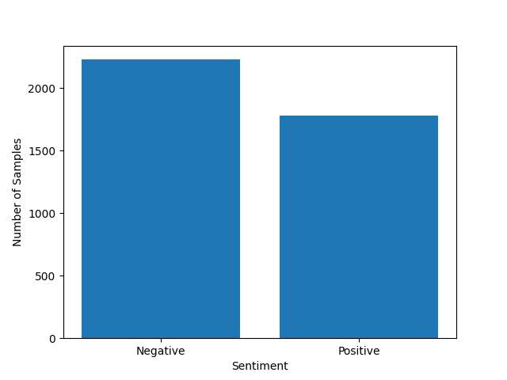


**Key insight:**
- Accuracy is not sufficient to judge the models → we focused on **F1-score**

## Feature Engineering

We encoded the airline_sentiment feature which was a categorical feature into numeric feature called sentiment as follows<br>
`df["sentiment"] = (df["airline_sentiment"] == "positive").astype(int)`

It was necessary to encode most important feature which is **text** certain into numeric to capture general characteristics of negative tweets . 
Some features were dropped as they were not influencing the Sentiment Variable.
Feature enginering has been done for EDA within the notebook. <br>
The `FeatureEngineering` is implemented  **src/feature_engineering.py**. This transformation is applied as the first step of the ML pipeline 
to ensure consistency during both training and inference.

### Key Transformations

| Feature | Description | Motivation |
|--------|-------------|------------|
| `airline_sentiment`|`sentiment` | Airline Sentiment is encoded into binary numeric feature 0/1 |
| `text` |`text_length`| text_length is a numeric feature derived from text which is the number of characters in tweet. |
| `text` | `word_count` |word_count is a numeric feature derived from text which is the number of words in tweet. |
| `text` | `neg_word_count` |neg_word_count is a numeric feature derived from text which is the number of negative words in tweet. |
| `text` | `all_caps_count` |all_caps_count is a numeric feature derived from text which is the number of words in CAPS in tweet. |
| `text` | `exclamations` |exclamations is a numeric feature derived from text which is the number of exclamations in tweet. |
| `text` | `has_negation` |has_negation is a numeric(binary) feature derived from text which indicates presence of negation like no/not/never etc. |
| **Dropped:** `Id`| Removed unique identifiers | Prevent data leakage and overfitting |
| **Dropped:** `user_timezone` | Has negligible impact on target variable | Has many missing values |
| **Dropped:** `airline`|May have slight impact on target variable| removed this feature to not introduce bias for an airline|
| **Dropped:** `airline_sentiment`|This is target variable encoded as new target variable **sentiment**|redundant feature|
### Why This Matters

- Most machine-learning algorithms operate on numbers, not labels or strings.
- We used Text feature to derive several numeric features like text_length, neg_word_count so that model learns characteristic features of negative and positive tweets
- Prevents **data leakage** by excluding unique identifiers
- Dropped columns like airline and user_timezone so that model can be built on important features.
- Converted Target Variable airline_sentiment into numneric binary feature sentiment


## EDA after Feature Engineering 

Due to limited features, we did EDA after feature engineering as follows:-


#### 1. Average Text Count by Sentiment
**Image in repository at:** `images/Average Text Length (characters) by Sentiment.png`

 by Sentiment.png>)

#### 2. Average Word Count by Sentiment
**Image in repository at:** `images/Average Word Count by Sentiment.png`


#### 3. Average Exclamation Count by Sentiment
**Image in repository at:** `images/Average Exclamation Count by Sentiment.png`


#### 4. Average Negative Word Count by Sentiment
**Image in repository at:** `images/Average Negative Word Count by Sentiment.png`


#### 5. Text Distribution 
**Image in repository at:** `images/text_length_distribution.png`

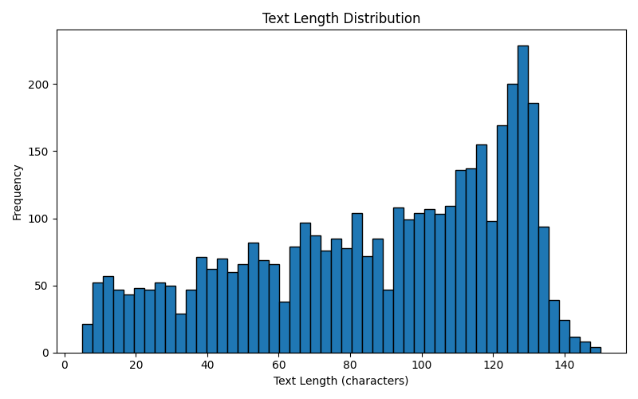

#### 6. Word Count Distributuon 
**Image in repository at:** `images/word_count_distribution.png`

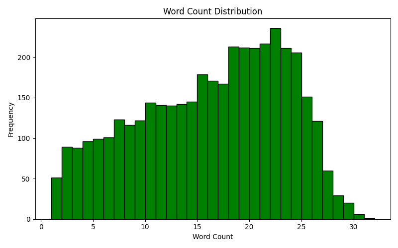

#### 7. Word Cloud Positive Tweets/Reviews
**Image in repository at:** `images/Word_Cloud_by_positive_sentiment.png`

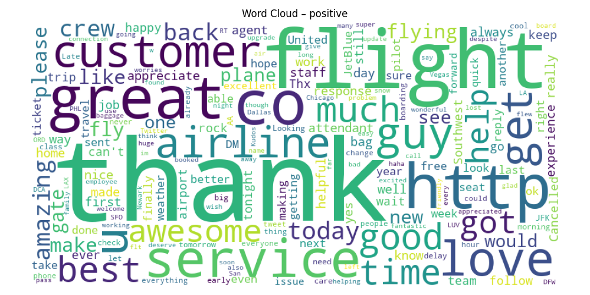


#### 8. Word Cloud Negative Tweets/Reviews
**Image in repository at:** `images/Word_Cloud_by_negative_sentiment.png`

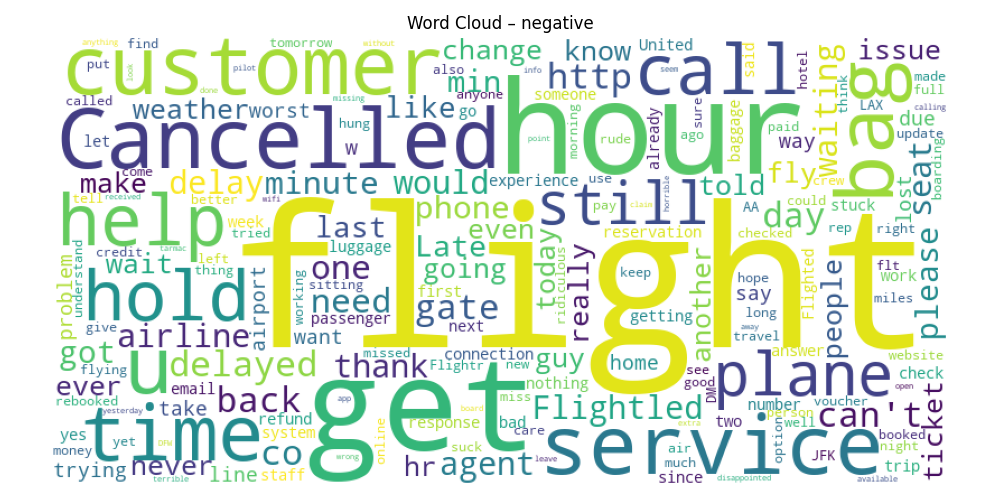

#### 9. (Categorical/Binary Features)


### 5. Correlation of Numeric Features

**Image in repository:** `images/correlation_matrix.png`

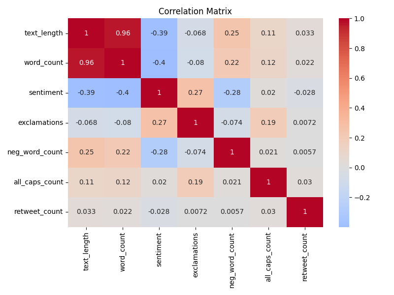

**Important correlations with `sentiment`:**
- `text_length`    →  -0.389326
- `word_count`     → -0.398904
- `exclamations`   →  0.268645
- `neg_word_count` → -0.276611
- `all_caps_count` → 0.020483
- `retweet_count`  → -0.027942   

#### Interpretation:
* **More Text Length** → More likely to be Negative Review as people rant about negative experiences
* **More Word Count** → More likely to be Negative Review
* **More exclamations** →Likely to be Positive Review
* **More Negative Word Count** → Most likely to be Negative Review
* **All Capital Words** →Likely to be Positive Review
* **Retweet Count** → More likely to be Negative Review as negative experience is retweeted to gather attention

## Model Training & Selection

The dataset was split into:
* 60% Training
* 20% Validation
* 20% Testing

Multiple models were trained using the training set and evaluated against the validation set. Hyperparameter tuning and threshold optimization were performed to maximize predictive performance, especially focusing on F1-score .

### Models Evaluated

| Model | Tuned Parameters | Decision Threshold | F1 Score | Precision | Recall |
|-------|------------------|-------------------|---------|-----------|----------|
| Logistic Regression | `C': 10, 'penalty': 'l2'` | 0.45 | 0.822259 | 0.765586 | 0.86236 | 
| Linear SVC| `'C':0.1,'class_weight':'balanced'` | NA | 0.851909   | 0.82  | 0.86 |
| Complementary Naive Baiyes | `'alpha': 0.1` | NA |0.84 | 0.83	 | 0.79	 |


```python

```

### Final Model Selection

After comparing performance across models, **LinearSVC** was selected as the final production model based on the following:

* Highest F1 Score on validation  
* Best overall Recall and Precision

### Pipeline Integration
The transformer is used as part of the final ML pipeline:
```python
pipeline = Pipeline(
    steps=[
        ("feature_engineering", FeatureEngineering()),
        ("preprocessing", preprocessor),
        ("classifier", LinearSVC(
                        C=0.1,
                        class_weight="balanced",
                        random_state=42
                            ))
    ]
```
## Exporting Notebook to Script

To comply with project requirements and ensure reproducibility, all essential machine learning steps developed in the notebook (`notebooks/notebook.ipynb`) were fully converted into Python scripts.

### Scripts Created

| Script | Purpose |
|--------|---------|
| `src/train.py` | Contains final model training pipeline and saves the trained model. |
| `src/predict.py` | Loads the trained model and serves predictions via a FastAPI REST endpoint. |
| `src/feature_engineering.py` | Implements the custom feature engineering logic. |

### What Was Exported from Notebook
The following core logic developed and validated in `notebooks/notebook.ipynb` was migrated into standalone scripts for production readiness:

| Exported Component | Implemented In | Description |
|-------------------|----------------|-------------|
| Data loading | `train.py` | Reads sentiment dataset from `data/airline_tweets_train.csv`. |
| Feature engineering logic | `feature_engineering.py` | Custom transformer class `FeatureEngineering`. |
| Model training & hyperparameter tuning | `train.py` | Uses tuned LinearSVC model parameters finalized from notebook experiments. |
| Final model training | `train.py` | Trains LinearSVC model on entire training dataset. |
| Model serialization (pipeline) | `train.py` | Saved using `pickle` as `models/model.pkl`. |
| API-based prediction logic | `predict.py` | Loads trained pipeline and serves predictions via FastAPI. |

### Example: Model Saving in `train.py`
```python
model_path = "models/model.pkl"
with open(model_path, "wb") as f:
    pickle.dump(pipeline, f)

### 
Example: Model Loading in `predict.py`
```python
MODEL_PATH = "models/model.pkl"
BASE_DIR = Path(__file__).resolve().parent.parent
with open(MODEL_PATH, "rb") as f_in:
    pipeline = pickle.load(f_in)
```

## Reproducibility

This project is fully reproducible. The dataset, notebook, and training scripts are included in the repository, allowing seamless re-execution.

- Dataset available in `data/airline_tweets_train.csv`
- Full analysis in `notebooks/notebook.ipynb`
- Feature Training function in `src/feature_engineering.py`
- Final model training located in `src/train.py`
- Inference logic exposed via `src/predict.py`
- Trained pipeline saved at `models/model.pkl`


### How to Reproduce
```bash
# Install dependencies and set up environment
uv sync

# Run training script
uv run python -m src.train

# Start FastAPI server
uv run uvicorn src.predict:app --reload --port 8000
```

---

## Model Deployment (Local)

The trained machine learning model is deployed locally using **FastAPI** and served via **Uvicorn**.

### Start API Locally
```bash
uv run uvicorn src.predict:app --reload --port 8000
```

Once the application is running:

- **Swagger UI (API documentation):** `http://localhost:8000/docs`
- **Root endpoint:** `http://localhost:8000/`

### Supported Features
- **Airline Tweets Sentiment Prediction API (POST):** `/predict` 
---

## Dependency & Environment Management

The project uses **uv** to manage dependencies and execution. All required packages are defined in `pyproject.toml` and `requirements.txt`.

### Install Dependencies
```bash
uv sync
```
### Example Execution Commands
```bash
uv run python -m src.train      # Train model
uv run uvicorn src.predict:app --reload --port 8000   # Launch API
```
---

## Dependency Files

### `requirements.txt`
```txt
fastapi==0.128.0
joblib==1.5.3
numpy==2.4.0
pandas==2.3.3
pydantic==2.12.5
pydantic_core==2.41.5
scikit-learn==1.8.0
scipy==1.16.3
seaborn==0.13.2
uv==0.9.21
uvicorn==0.40.0

```

### `pyproject.toml`
```toml
[project]
name = "sentimentanalysis-airlines"
version = "0.1.0"
description = "Tp predict the Sentiment class"
readme = "README.md"
requires-python = ">=3.12"
dependencies = [
    "fastapi>=0.128.0",
    "pandas>=2.3.3",
    "scikit-learn>=1.8.0",
    "uvicorn>=0.40.0",
    "xgboost>=3.1.2",
    "pydantic>=2.12.5",
    "pydantic_core>=2.41.5",
    "numpy>=2.4.0",
    "pandas>=2.3.3",
    "scipy==1.16.3",
    "notebook>=7.5.1",
]

[dependency-groups]
dev = [
    "requests>=2.32.5",
]

]


```
---

## Containerization (Docker)

The project is fully containerized using **Docker**, allowing consistent deployment across environments.

### Dockerfile Used
```dockerfile
FROM python:3.12-slim

# ==============================
# Environment settings
# ==============================
ENV PYTHONDONTWRITEBYTECODE=1
ENV PYTHONUNBUFFERED=1

# ==============================
# Working directory
# ==============================
WORKDIR /app

# ==============================
RUN apt-get update && apt-get install -y \
    build-essential \
    libgomp1 \
    && rm -rf /var/lib/apt/lists/*

# ==============================
# Python dependencies
# ==============================
COPY requirements.txt .
RUN pip install --no-cache-dir -r requirements.txt


# ==============================
# Copy only required files
# ==============================
COPY src ./src
COPY models ./models

# ==============================
# Expose API port
# ==============================
EXPOSE 8000

# ==============================
# Run FastAPI
# ==============================
CMD ["uvicorn", "src.predict:app", "--host", "0.0.0.0", "--port", "8000"]

```
---


### Build the Docker Image

Run the following command inside the project folder:
```bash
docker build -t airline-sentiment-api .
```
---

### Run the Docker Container
```bash
docker run -p 8000:8000 airline-sentiment-api
```

Once started, the API will be available at:
- **Local URL** → `http://localhost:8000/docs/`
- **Swagger UI** → `http://localhost:8000/docs/`
---

### Local Deployment Images
#### API Testing Examples

#### 1. Transaction (POST /predict)

##### Request

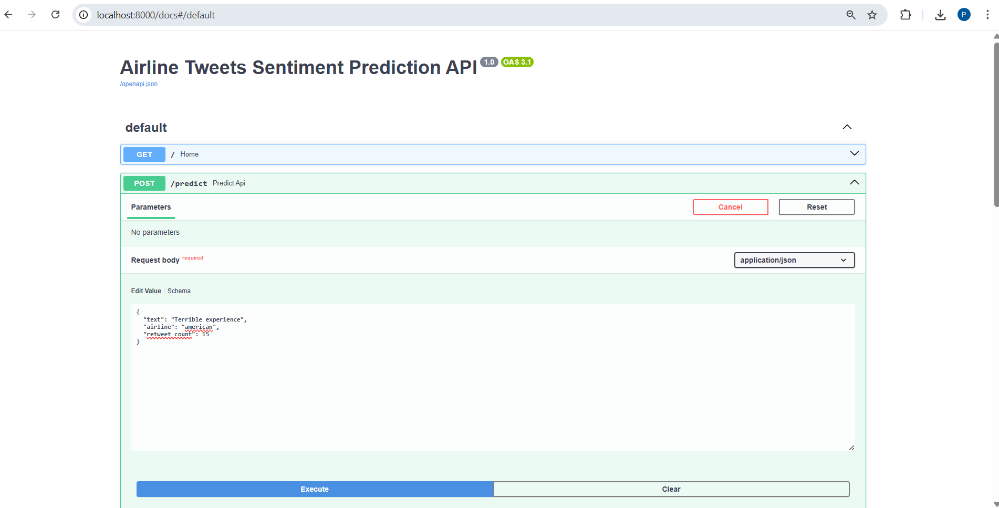

```json

{
  "text": "Terrible experience",
  "airline": "american",
  "retweet_count": 15
}

```

##### Response:

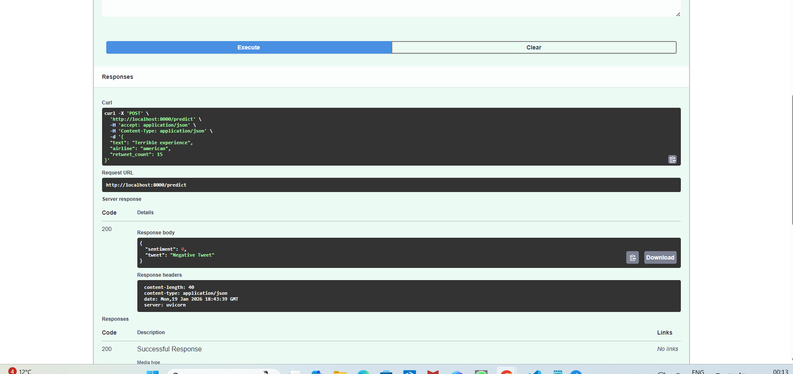

```json
{
  "sentiment": 0,
  "tweet": "Negative Tweet"
}
```


## Cloud Deployment

The Airline Tweets Sentiment Prediction API is deployed on Render using FastAPI and Docker, enabling real-time sentiment class inference through RESTful endpoints.

### Deployment Steps (Docker + Render)

#### 1. Push complete project to GitHub
[github repo link]
(https://github.com/priyasea/SentimentAnalysis_Airlines)


#### 2. On Render Dashboard → “New Web Service”

#### 3. Select Deployment Settings

| Setting | Value |
|---------|-------|
| Environment |	Docker |
| Repository | `priyasea/SentimentAnalysis_Airlines` |
| Branch | main |
| Root Directory | `(leave empty)` |
| Environment Variables | `PORT=8000` |
| Instance Type | Free Tier |

#### 4. Click "Deploy Web Service"

Render automatically:

* Pulls repo

* Builds Docker image

* Runs FastAPI service using command from Dockerfile
```CSS
CMD ["uvicorn", "src.predict:app", "--host", "0.0.0.0", "--port", "8000"]
```
---

##  Proof of Successful Deployment

### Render Deployment Configuration
[Deployment Video – Predict API](images/cloud_deployment/AirlineTweetSentimentPrediction_RenderVideo.mp4)   
### Render URL: https://sentimentanalysis-airlines.onrender.com

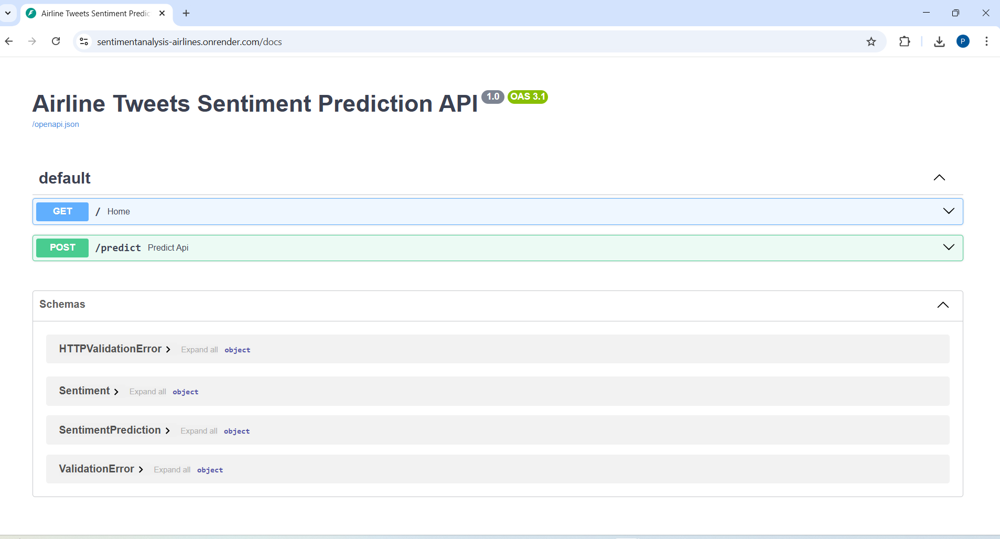


### API Testing Examples

#### 1. Single Transaction (POST /predict)

##### Request

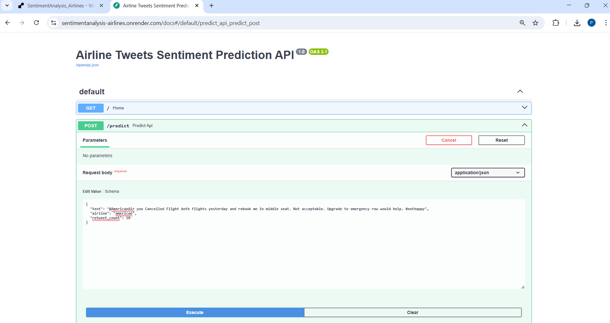

```json

{
  "text": "@AmericanAir you Cancelled Flight both flights yesterday and rebook me in middle seat. Not acceptable. Upgrade to emergency row would help. #nothappy",
  "airline": "american",
  "retweet_count": 10
}
```

##### Response:

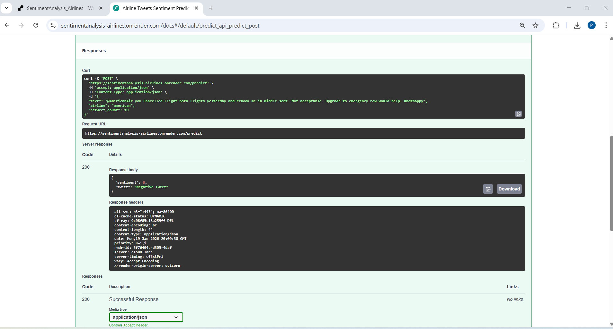

```json
{
  "sentiment": 0,
  "tweet": "Negative Tweet"
}
```

## Conclusion

This project successfully implements an end-to-end Airline Tweet Sentiment Prediction system for Twitter tweets using machine learning. After performing detailed exploratory data analysis, feature engineering, and model comparison, LinearSVC was selected as the final model due to its high performance:

F1-Score: 0.943001

Precision: 0.45

Recall: 
The final solution was packaged with FastAPI, containerized using Docker, and deployed on Render, enabling real-time prediction of tweets. The system is ready for integration into production environments to help Airliners to improve their services after reading negative tweets. Flight carriers can engage with customer based on their tweet and ask for constructive feedback


```python

```
